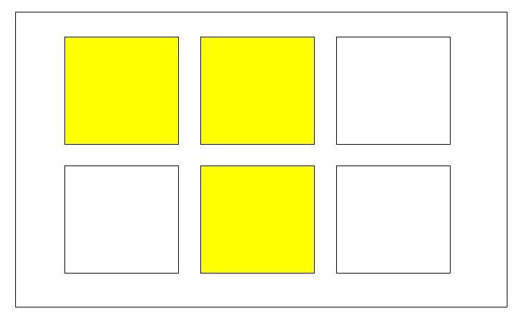

# Игра на запоминание

## Правила
1) Создайте 6 пустых карточек и залейте рандомное количество карточек одним любым цветом.
2) Через 4 секунды, все карточки должны быть белого цвета.
3) Пользователь должен выбрать карточки, которые были залиты желтым (например) цветом, кликом по карточке.
4) Если пользователь кликнул правильно, то карточка должна стать желтым (например) цветом. 
5) Если кликнул неправильно, то карточка должна окраситься в красный цвет и нужно прервать игру с АЛЕРТОМ: Вы неправильно выбрали карточку. Попробуйте еще раз. 
6) Дайте пользователю возможность выбрать уровень игры. Если уровень легкий, то 6 карточек и 4 секунды времени. Если уровень средний, то  9 карточек и 3 секунды времени. Если уровень тяжелый, то 12 карточек и 2 секунды времени 

### Release 0
Создайте страницу с правилами игры и разместите 3 кнопки с 3 уровнями.

### Release 1
Задайте каждой кнопке атрибут `data`. Для легкой уровня - `data-easy-level`, для среднего уровня уровня - `data-middle-level`, для тяжелого уровня - `data-hard-level`.

### Release 2
Создайте функцию, которая будет отрисовывать карточки в зависимости от уровня. Пример можно посмотреть в задании [Super-Form](https://github.com/Elbrus-Bootcamp/super-form/blob/master/index.js). Посмотрите как написана функция `createUser`. На этом этапе можно сразу добавить индекс для каждой карточки через атрибут `data`. Например: `data-index="2"`, то есть вторая карточка в первой строчке

### Release 3
Повесьте на каждую карточку слушатель событий `click`. Определите по какой карточке кликнули. На этом этапе необязательно прописывать всю логику. Главное, чтобы по клику на карточку вы хотя бы могли вывести информацию в консоль об этой карточке. Проверьте, что у вас клики отрабатывают только по клику на карточку. Между карточками и за пределами карточек ничего не должно происходить.

### Release 4
Создайте функцию, которая будет возвращать рандомное число 6, 9 или 12 в зависимости от уровня игры.

### Release 5
Получите доступ ко всем карточкам через `querySelectorAll`.

### Release 6
Вызовите функцию из релиза 4, чтобы получить число карточек, которые будут залиты желтым цветом.

### Release 7
Вызовите функцию из релиза 4, чтобы получить индексы карточек, которые будут залиты желтым цветом. Вызвать нужно в зависимости от того, какое число вы получили в релизе 7. Не забудьте, что индексы в массиве начинаются 0.

### Release 8
Сохраните индексы в массиве, чтобы потом проверить, что индекс карточки по которой кликнул пользователь, есть в массиве.

### Release 9
Доработайте функцию из релиза 3.

### Release 10
Залейте карточки желтым цветом.

### Release 11
Поставьте функцию `setTimeOut` в зависимости от уровня игры. Можете создать функцию, которая будет принимать количество секунд и передавать в `setTimeout`.

### Release 12
Залейте свою работу в `Github Pages`, чтобы в нее могли поиграть ваши близкие, знакомые и друзья 

