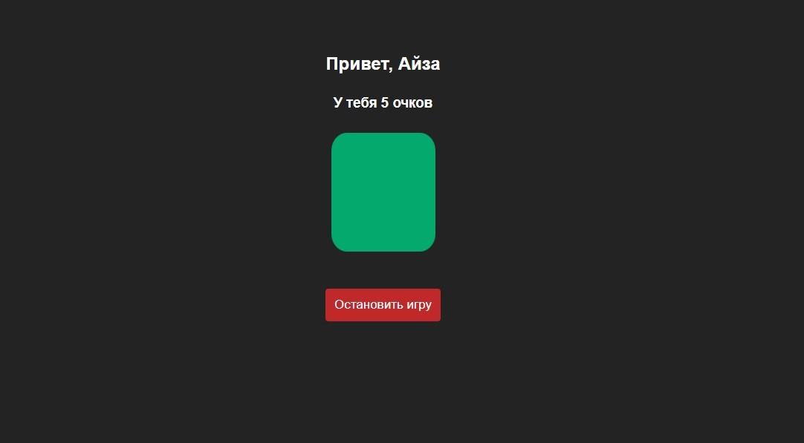

## Описание игры

В данном задании тебе предстоит реализовать игру, где нужно будет отлавливать зеленый цвет карточки. 

    

### Правила

1. На экране выведем форму с инпутом, куда записываем имя игрока, и кнопку "Начать игру"
2. Пользователь нажимает на кнопку и попадает на страницу `game.html`
3. В "game.html" выводим имя игрока и заработанное количество очков. Начальное значение - 0
4. Также там есть карточка любого цвета, кроме зеленого, и кнопка "Остановить игру"
5. Карточка через рандомное количество секунд окрашивается в зеленый. Суть игры - нажать на карточку в тот момент, когда она зеленая. Так зарабатывается по 5 очков.
6. По клику "Остановить игру" выводим надпись итоговое количество очков пользователя.

### Релиз 0

У тебя уже есть готовый файл `index.html`, к нему прикреплен `style.css`, однако стилей в нём нет. Там должна быть форма с инпутом и кнопкой "Начать игру". Стилизуй начальную страницу. 

### Релиз 1

В файле `index.js` напиши функцию, которая ловит имя из инпута и проверяет, что там не пусто. 

### Релиз 2

Сохрани имя игрока в `localStorage`.

### Релиз 3

Теперь перейди к `game.html`, где будет происходить сама игра. Выведи имя игрока из `localStorage`, количество его очков, карточку и красную кнопку "Остановить игру". Начальное количество игроков - 0. Не забудь стилизовать.

### Релиз 4

Карточка может быть только 2х цветов: серый или зеленый. Подумай, как менять цвет карточки каждые 3 сек. Напиши функцию, которая меняет цвет карточки. Подсказка: можно добавить атрибут `data-isActive`, который будет хранить булевое значение. Если `isActive == true`, то цвет зеленый.

### Релиз 5

Реализуй функцию, которая по клику на карточку проверяет цвет карточки. Если карточка зеленая - добавляем 5 очков за каждый правильный клик. Если нет - 0 очков.

### Релиз 6

Давай теперь усложним. Пусть карточка будет окрашиваться в зеленый не каждые 3 сек, а через рандомное количество секунд. Максимальная пауза - 7 сек. 

### Релиз 7

Залейте свою работу в `Github Pages`, чтобы в нее могли поиграть ваши близкие, знакомые и друзья.
