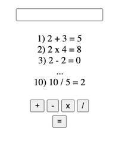

# Эльбрус Калькулятор

## Как должен работать калькулятор
1) Пользователь вводит любое число (например: `2`).
2) Нажимает на одну из 4 кнопок: `+`, `-`, `x`, `/` (например: `+`). Выбранная кнопка должна отличатся по стилю от других кнопок.
3) Введенное число сохраняется на странице (`2 + `) и поле ввода очищается.
4) Вводит второе число (например `3`).
5) Нажимает на `=`. Второе введенное число сохраняется на странице с ответом (`2 + 3 = 5`). Поле ввода очищается. Стили выбранной кнопки из пункта 2 сбрасываются.
6) История последних 10 вычислений должна сохраняться. Одиннадцатое вычисление должно перезаписать первое и тд.

<div align="center">
    
</div>

### Release 0
Подключите `css` и `js` в `index.html`.

### Release 1
Создайте поле, куда можно ввести число `<input type="text" />`.

### Release 2
Создайте 5 кнопок: `+`, `-`, `x`, `/`, `=`.   

### Release 3
Добавьте стили, чтобы ваш калькулятор был красивым.

### Release 4
Получите из инпута введенное число и сохраните в переменную. Помните, что число, которое получите из поля ввода, нужно перевести в тип `number`.

### Release 5
Чтобы было легче перенести введенное число на страницу по клику на одну из кнопок `+`, `-`, `x`, `/`, добавьте всем кнопкам `data` атрибут. Например: `data-math-operation`. Затем, получите доступ ко всем кнопкам по этому атрибуту и повесьте слушатель событий `click`. 

### Release 6
Как перезаписывать после 10 вычислений? Создайте такую структуру в `html`:
```HTML
<div class="history">
    <div class="operation">
        <span class="counter">1)</span>
        <span class="result">1 + 2 = 3</span>
    </div>
    <div class="operation">
        <span class="counter">2)</span>
        <span class="result">2 - 2 = 0</span>
    </div>
</div>
```
Получите доступ ко всем `operation`. Это можно сделать: 
```JS
const operations = document.querySelectorAll('.operation')
const history = document.querySelector('.history')
```
Перед тем, как нажать на `=`, проверьте длину `operations`. Если длина больше 10, то сделайте `history.prepend('str')` вместо `append`. Не забудьте перерисовать счетчики, после `prepend`.


