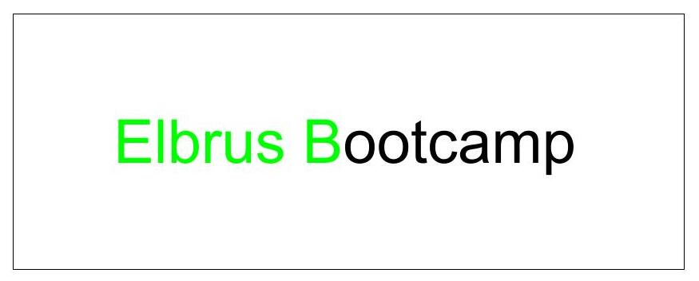

# Игра: Печаттор

## Правила
1) На экране появляется слово или предложение 
2) Пользователь должен набрать слово по буквам 
3) Если правильно набрали букву, то она должна стать зеленого цвета 
4) Если ввели неправильно, то нужно уменьшить время, которое осталось, на 5 секунд 
5) Если слово ввели правильно и осталось время, нужно добавить новое слово 
6) Введите таймер и счет правильно введенных слов

### Release 1
Создайте массив из 20-30 слов, чтобы слова часто не повторялись.

### Release 2
Создайте таймер. Если не получится обновлять время, загуглите как создавать таймеры с помощью JS и HTML. Добавьте таймер на страницу.

### Release 3
Создайте функцию, которая будет принимать строку и добавлять каждую букву в тег `span`. Также, можно добавить каждому span-у атрибут `data-index`.   
Например, слово “We”:
`We`

### Release 4
Добавьте слушатель на каждый span. Подумайте, какой слушатель событий подойдет лучше всего для этой игры.

### Release 5
Создайте счетчик, который будет указывать на первую букву в начале игры.

### Release 6
Если пользователь правильно написал первую букву, увеличьте счетчик из релиза 5 на 1.

### Release 7
Создайте функцию, которая будет отнимать 5 секунд из текущего таймера, если пользователь неправильно ввел букву.

### Release 8
Если слово было введено правильно, замените слово на новое и обновите счетчик из релиза 5.

### Release 9. Advanced
Если пользователь ввел букву неправильно, добавьте над словом окошко на 2 секунды с сообщением, что буква была введена неправильно.

### Release 10
Залейте свою работу в `Github Pages`, чтобы в нее могли поиграть ваши близкие, знакомые и друзья.
